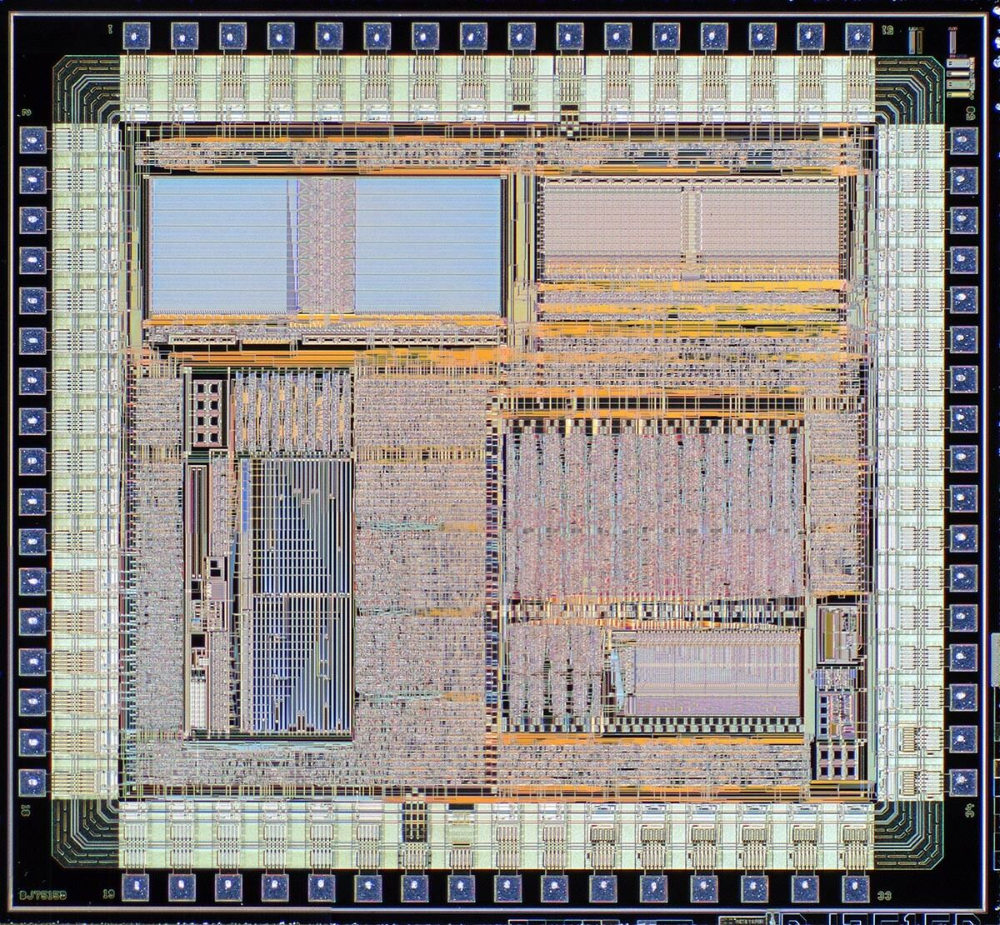

# Challenge Coin GT Bidouille

Vous vous êtes bien reposé, vous avez bien profité et vous trainez des pieds pour le retour. Du coup quoi de plus sympathique que de commencer cette rentrée par un petit challenge !

Il y a 2 versions de ce challenge, une version un peu corsée, de guessing diront certains, et une version, avec les mêmes types de challenges, plus adaptée aux personnes débutantes ( enfin je l'espère). vous pouvez commencer par la simplifiée et vous frotter à la plus corsée :)

Pour commencer, il faut faut le coin ci dessous. Il contient tout ce qu'il faut pour débuter et même d'autres informations pour au moins une autre ....

&

il contient 
- de quoi commencer le challenge et d'aller plus loin
- un Die ( voir plus bas)
- 1 Condensateur 100nf taille 603
- 2 résistAnces 10Kohm taille 805
- par manque de place, il n'y a pas de Diode, pas de lEd ni de mémoire Flash 

pour la version simplifiée, juste admirez le coin...

il y a plusieurs challenges avant d'arriver au but et quand vous penserez être arrivé au bout, peut être que non :)  mais au final, en plus de l'amusement que cela pourrait vous procurer, il y a quelques lots comme le vrai badge du MCH2022 ( https://wiki.mch2022.org/Badge), un tshirt commémoratif ( il faut que je regarde si j'ai le droit de le faire) , ....

quelques rêgles/infos 
- c'est pour le fun, donc pas de pression ! sauf peut être à la fin mais c'est un autre GT :)
- pas besoin de brute force, jamais. Vous pouvez le faire mais tout le necessaire pour résoudre les challenges est sous vos yeux
- ce qui peut paraitre comme des anomalies ne l'est pas forcement ( il y a forcement des erreurs mais quand c'est trop gros...)
- un petit write up est attendu. Pas obligatoire mais c'est toujours sympa ( j'ai en mémoire un write up du SSTIC qui disait j'ai plié la première étape, ma mère m'a appelé pour manger, puis j'ai plié le reste dans l'après midi ) 
- le challenge sera accessible pendant 1 an. 
- pour les personnes qui le souhaitent, un suivi du Challenge se tiendra sur un ctfd à l'adresse gt-bidouille.fun:55555. Pensez à vous créer un compte sans ne mettre aucune information autre que votre pseudo ou votre prénom. En mail, mettez un truc random, de toutes les façons il n'y a pas de serveur de mail derrière
- le challenge commencera le 8 septembre, le temps de diffuser quelques coins !

Le Die en question  (Sa taille est de 2,5mm x 3,2mm). Le datasheet est sur ce site 

Si vous voulez en savoir un peu plus sur les dies => https://fr.wikipedia.org/wiki/Die_(circuit_int%C3%A9gr%C3%A9)